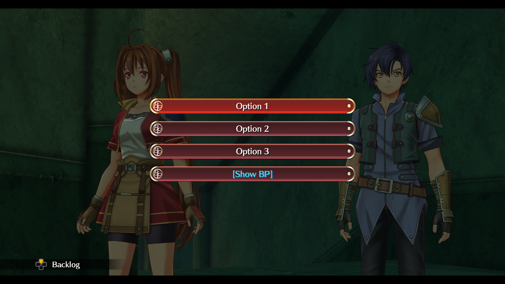
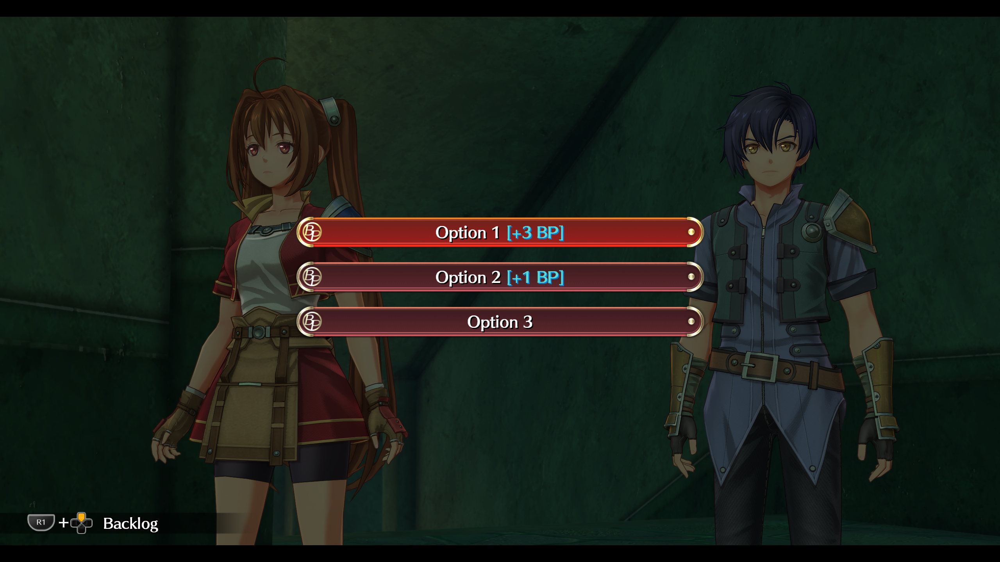
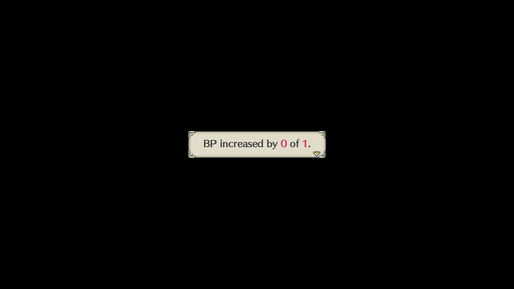
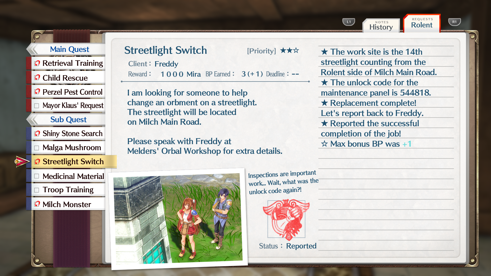

# Show BP for Trails Remakes
Mod(s) for _Trails_ series remakes that add the ability to show the correct dialogue options for bonus BP, show max possible bonus BP in addition to obtained bonus BP in system popups, and show total max possible bonus BP for quests in the notebook. Currently supports Sky 1st.

## Features
1. Adds menu item [Show BP] to all BP-related dialogue choices, including main and side quests. When selected, it reveals the bonus BP answers and amounts when relevant for each dialogue choice. Otherwise, these menus function as the originals would. Implemented this way, you won't get spoiled on the correct choice(s) before you've had a chance to think, and you can safely ignore the Show prompt for any choice should you desire.

       
    

2. Adds max bonus BP amounts to system messages that display after events in which you receive bonus BP. These messages also now display when getting 0 BP (with some exceptions, see notes below). 

    

3. Adds max bonus BP amounts for entire quests to their completion comments in the notebook to have a lasting way to check and compare with what you received.
    
 
        
Very minor early quest spoiler (click to show image)

         
          
    

## Installation
1. Download the latest show-bp.zip corresponding to your game from [Releases](https://github.com/tanabrae/TrailsRemake-ShowBP/releases).
2. Download the latest [xinput1_4.dll](https://github.com/Hinkiii/sora1looseload/releases) from Hinkiii's [sora1looseload](https://github.com/Hinkiii/sora1looseload) repo.
3. Extract the .zip file and place the contained *script\_en* and *table\_en* folders, along with *xinput1\_4.dll*, in the game root folder (where the game's .exe is located).

## Details
* The main purpose of this mod is to partially mitigate the need for external sources of info when trying to obtain all BP, while attempting to strike a balance between usability and unobtrusiveness. 

* While using this mod, you still need to pay attention to quest markers and complete extra objectives if you want to get all the BP you can.

* As mentioned above, some interactions don't have system messages for 0 obtained bonus BP because the points at which the popups would normally display don't exist if the related content is skipped entirely. I only wanted to tweak existing messages in the exact location they were meant to be shown instead of placing brand new messages (especially in almost-certainly awkward scene transitions). Such interactions are all still marked on the map, have menu options to reveal BP choices, and will show up in the notebook text entries upon quest completion, however.

* I've personally tested the mod on a full BP playthrough, but there could still be issues. I would also recommend saving often and across multiple slots just in case, as you typically should when using mods.

## Compatibility
This mod may or may not be compatible with other mods that edit the games' scripts and tables. In the case that edited files are shared between mods, you will have to manually merge them for full compatibility, given both mods don't touch the exact same data.

### Chest Messages Mod
That said, I went ahead and merged the files of this mod and my chest messages mod into a separate, standalone .zip for those who want to use both mods at the same time. You can read about that mod [here](https://github.com/tanabrae/TrailsRemake-ChestMessages), and you can download the combined chest-messages_show-bp.zip in [Releases](https://github.com/tanabrae/TrailsRemake-ChestMessages/releases) for that mod. Currently supports Sky 1st.

## Credits
+ [Kyuuhachi](https://github.com/Kyuuhachi) for developing the [Aureole-Suite](https://github.com/Aureole-Suite), primarily [Ingert](https://github.com/Aureole-Suite/Ingert) for script editing
+ [nnguyen259](https://github.com/nnguyen259) and the maintainers and contributors of [KuroTools](https://github.com/nnguyen259/KuroTools) for table editing
+ [Hinkiii](https://github.com/Hinkiii) for creating [sora1looseload](https://github.com/Hinkiii/sora1looseload)
